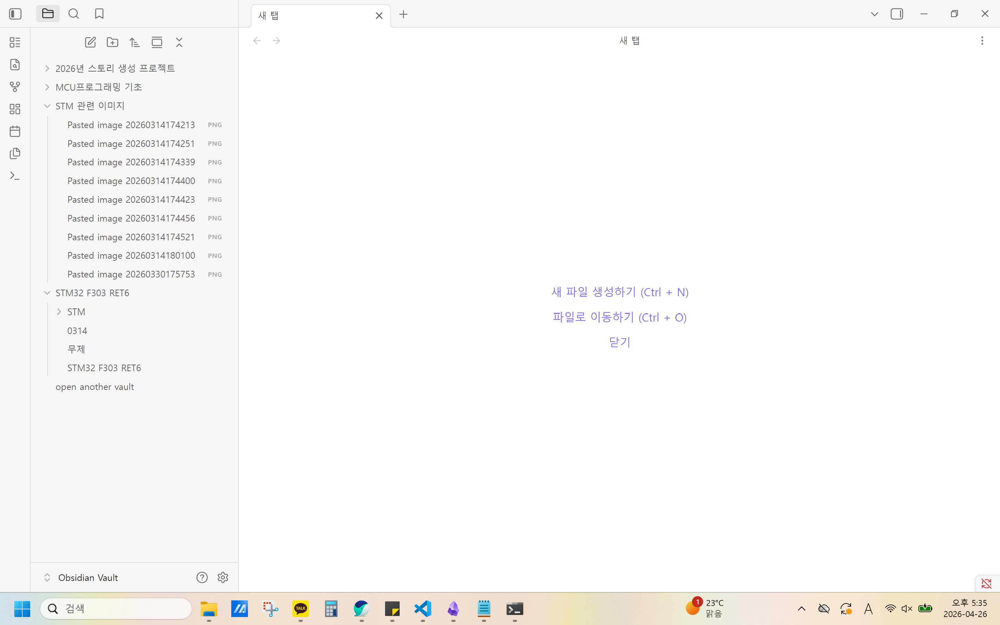

CubeMX - window 버전 6.17.0 

설치 저장소
C:\Users\sedk1\AppData\Local\Programs\STM32CubeMX

ST-LINK 드라이버 // STSW-LINK009
https://www.st.com/en/development-tools/stsw-link009.html?utm_source=chatgpt.com

CubeCLT - window 버전 1.21.0
https://www.st.com/en/development-tools/stm32cubeclt.html#

datasheet 참고 
https://os.mbed.com/platforms/ST-Nucleo-F303RE/

cmake --preset Debug
cmake --build --preset Debug

맨처음
STM32_Programmer_CLI -c port=SWD -w .\build\Debug\파일명.elf -v -rst

이후
STM32_Programmer_CLI -c port=SWD mode=UR -w build\Debug\파일명.elf -v -rst

